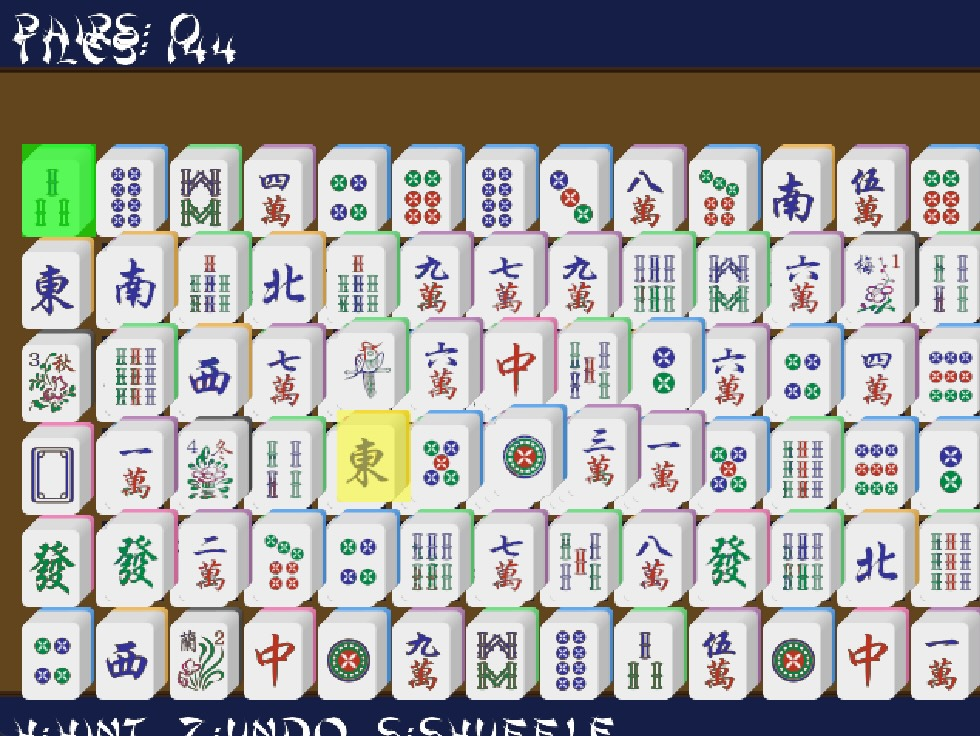

# Mahjong Solitaire for Lutro

Controller-first Mahjong Solitaire for [Lutro](https://github.com/libretro/libretro-lutro) libretro core. Runs at 640x480 with pixel-art tiles, bitmap font, gamepad support, undo, hints, shuffling, and Lutro savestates.

## Requirements

- RetroArch with `lutro_libretro`
- Python 3.9+ for asset generation and packaging
- Python packages: `cairosvg` and `Pillow`

Install asset-tool dependencies with `python3 -m pip install cairosvg Pillow`.

## Run

Generate assets and launch local RetroArch installation:

```sh
python3 tools/launch.py
```

`tools/launch.py` expects macOS RetroArch paths. Edit `RETROARCH_PATH` and `CORE_PATH` for another installation, or load repository root directly through Lutro in RetroArch.

## Screenshot



## Controls

| Input | Action |
| --- | --- |
| D-pad or arrow keys | Move cursor between playable tiles |
| A / `X` | Select tile or confirm pair |
| B / `Z` | Cancel selection |
| `H` | Highlight a legal pair |
| `S` | Shuffle remaining tile faces |
| `U` | Undo most recent removed pair |
| Escape | Start game from title screen |

## Rules

A tile is playable when no tile is above it and either horizontal side is open. Remove two playable matching tiles. Numbered, wind, and dragon tiles need exact matches. Any two flowers or any two seasons match. Clear all 144 tiles to win.

## Build Package

```sh
python3 tools/package.py
```

Creates `out/mmmahjong.lutro`. Archive root contains `main.lua`, Lua modules, and only Lutro runtime assets. This layout is required by Lutro: it loads `main.lua` from archive root and resolves asset paths relative to it.

## Project Layout

```text
main.lua                 Development entry point; adds src/ to module path
src/main.lua             Lutro callbacks and game-state orchestration
src/conf.lua             Game constants, deck definitions, input mapping
src/board.lua            Fixed layout, playability, legal-pair queries
src/cursor.lua           Controller navigation and selection state
src/render.lua           Lutro drawing and bitmap-text helpers
src/tiles.lua            Deck creation, shuffling, matching rules
assets/generated/        Lutro-ready sprite sheet and bitmap font
tools/                   Asset generators, launcher, and packager
docs/game_rules.md       Expanded gameplay reference
```

## Contributing

Keep game code compatible with Lua 5.1 and Lutro's LÖVE subset. Do not add desktop-only LÖVE APIs, TrueType font loading, filesystem APIs, or shaders to runtime Lua. Generated PNG files are runtime assets; regenerate them with tools after changing source art or font configuration.

Project licensed under [MIT](LICENSE).


## Assets:
- Sounds:
  - `ceramic.wav`: [Single Ceramic Tee Mug Table Clink](https://pixabay.com/sound-effects/film-special-effects-single-ceramic-tee-mug-table-clink-544816/) (Shortened and converted to waveform with Audacity)
- Music:
  - `Dragon Dance - Loop.ogg` and `Lotus Pond - Loop.ogg`: [Chinese Game Music](https://bitemegames.itch.io/chinese-game-music) (Reformated with ffmpeg (libvorbis) quality 1)
- Tiles:
  - [Mahjong](https://demching.itch.io/mahjong)
- Fonts:
  - `shanghai.ttf`: [Shanghai](https://www.dafont.com/shanghai.font)
